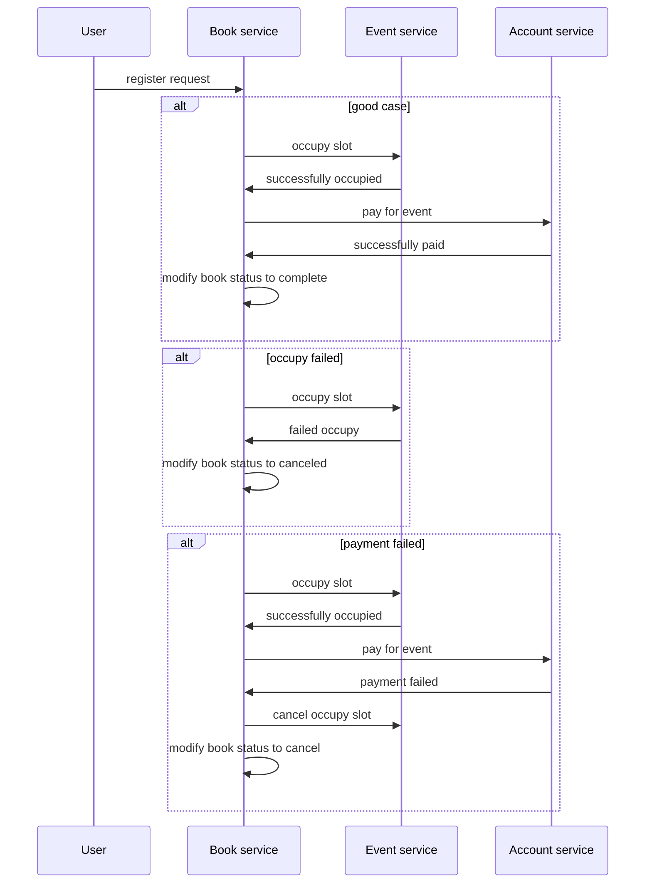

# otus-task-7


реализован шаблон "сага"




приложения деплоятся в пространство saga

```
git clone https://github.com/xost/otus-task-8.git

cd otus-task-8

cd auth
skaffold run
cd ../events
skaffold run
cd ../account
skaffold run
cd ../book
skaffold run

```
Авторизуемся:
```
curl -v -X POST http://arch.homework/login -d '{"login":"admin","password":"password"}'
```
cookie:
```
session_id=8217c169-503a-4248-8133-4a4d6bbac437
```
Пополним баланс:
```
curl -v --cookie session_id=8217c169-503a-4248-8133-4a4d6bbac437 -X PUT http://arch.homework/account/deposit -d '{"delta":100}'
curl -v --cookie session_id=8217c169-503a-4248-8133-4a4d6bbac437 -X GET http://arch.homework/account/get
```
balance
```
{"balance":100}
```
Создадим мероприятия:
```
curl -v --cookie session_id=8217c169-503a-4248-8133-4a4d6bbac437 -X POST http://arch.homework/events/create -d '{"event_name":"red run","price":40,"total_slots":5}'
curl -v --cookie session_id=8217c169-503a-4248-8133-4a4d6bbac437 -X POST http://arch.homework/events/create -d '{"event_name":"green run","price":5,"total_slots":3}'
curl -v --cookie session_id=8217c169-503a-4248-8133-4a4d6bbac437 -X GET http://arch.homework/events/get
```
events:
```
[{"id":1,"event_name":"green run","price":5,"total_slots":3},{"id":2,"event_name":"red run","price":40,"total_slots":5}]
```
попробуем зарегистрироваться на мероприятие:
```
curl -v --cookie session_id=8217c169-503a-4248-8133-4a4d6bbac437 -X POST http://arch.homework/book/create -d '{"event_id":1}'
curl -v --cookie session_id=8217c169-503a-4248-8133-4a4d6bbac437 -X GET http://arch.homework/book/get
```
успешно:
```
[{"id":1,"user_id":1,"event_id":1,"price":5,"status":4}]
```
повторим несколько раз:
```
curl -v --cookie session_id=8217c169-503a-4248-8133-4a4d6bbac437 -X POST http://arch.homework/book/create -d '{"event_id":1}'
curl -v --cookie session_id=8217c169-503a-4248-8133-4a4d6bbac437 -X POST http://arch.homework/book/create -d '{"event_id":1}'
curl -v --cookie session_id=8217c169-503a-4248-8133-4a4d6bbac437 -X POST http://arch.homework/book/create -d '{"event_id":1}'
curl -v --cookie session_id=8217c169-503a-4248-8133-4a4d6bbac437 -X GET http://arch.homework/events/get
```
последняя регистрация отменена, т.к. не осталось свободных слотов:
```
[{"id":1,"user_id":1,"event_id":1,"price":5,"status":4},{"id":2,"user_id":1,"event_id":1,"price":5,"status":4},{"id":3,"user_id":1,"event_id":1,"price":5,"status":4},{"id":4,"user_id":1,"event_id":1,"status":-1}]
```
зарегистрируемся на другое мероприятие:
```
curl -v --cookie session_id=8217c169-503a-4248-8133-4a4d6bbac437 -X POST http://arch.homework/book/create -d '{"event_id":2}'
curl -v --cookie session_id=8217c169-503a-4248-8133-4a4d6bbac437 -X GET http://arch.homework/book/get
```
успешно:
```
[{"id":1,"user_id":1,"event_id":1,"price":5,"status":4},{"id":2,"user_id":1,"event_id":1,"price":5,"status":4},{"id":3,"user_id":1,"event_id":1,"price":5,"status":4},{"id":4,"user_id":1,"event_id":1,"status":-1},{"id":5,"user_id":1,"event_id":2,"price":40,"status":4}]
```
повторим:
```
curl -v --cookie session_id=8217c169-503a-4248-8133-4a4d6bbac437 -X POST http://arch.homework/book/create -d '{"event_id":2}'
curl -v --cookie session_id=8217c169-503a-4248-8133-4a4d6bbac437 -X POST http://arch.homework/book/create -d '{"event_id":2}'
curl -v --cookie session_id=8217c169-503a-4248-8133-4a4d6bbac437 -X GET http://arch.homework/book/get
```
последняя регистрация отменена, т.к. недостаточно средств на балансе:
```
[{"id":1,"user_id":1,"event_id":1,"price":5,"status":4},{"id":2,"user_id":1,"event_id":1,"price":5,"status":4},{"id":3,"user_id":1,"event_id":1,"price":5,"status":4},{"id":4,"user_id":1,"event_id":1,"status":-1},{"id":5,"user_id":1,"event_id":2,"price":40,"status":4},{"id":6,"user_id":1,"event_id":2,"price":40,"status":4},{"id":7,"user_id":1,"event_id":2,"price":40,"status":-1}]
```
проверим баланс:
```
curl -v --cookie session_id=8217c169-503a-4248-8133-4a4d6bbac437 -X GET http://arch.homework/account/get
```
```
{"balance":5}
```
